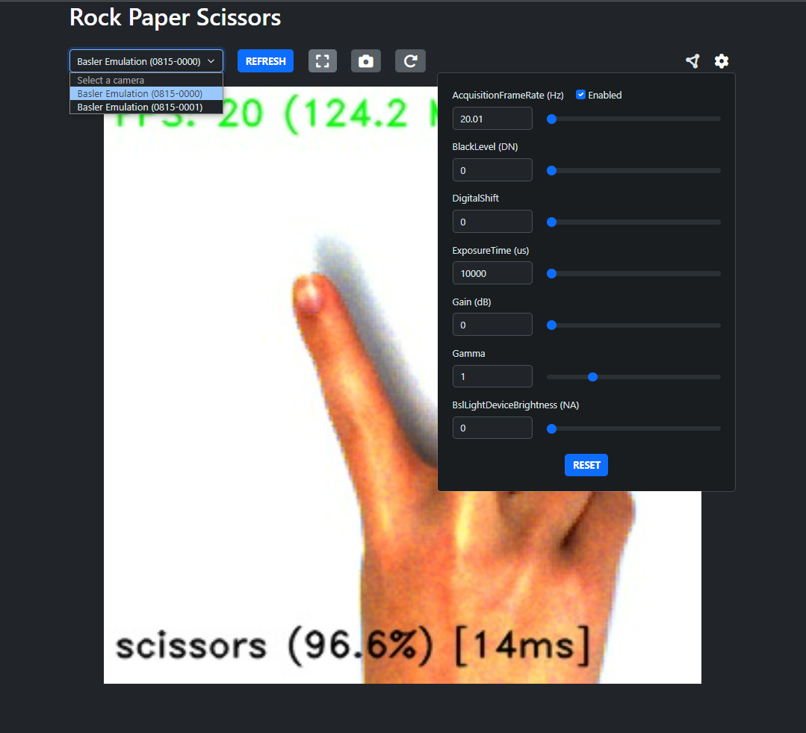

# RockPaperScissors

[](https://opensource.org/licenses/MIT)
[](https://www.plcnextstore.com/permalinks/apps/latest/60002172000770)


This is a showcase application from the SPS 2023.
The goal of this application is to showcase Ethernet TSN and machine learning (vision) with PLCnext in one convergent network.

This project is available as a ready-use app in the [PLCnext Store](https://www.plcnextstore.com/permalinks/apps/latest/60002172000770).
Works on any x86 PLC and without any additional hardware (emulation cameras available).
The engineer project can be found in the [engineer](./engineer/) folder, but is not necessary.

## Model

A machine-learning model was trained on a public dataset with rock-paper-scissors images and some recorded images with the camera setup.
The model classifies the images into 4 classes: blank, paper, rock, scissors.
The is converted to [ONNX](https://onnx.ai/); an intermediate format that's build for inferencing.

*Note*: This is repository does not include a trained model. You can download the model [here](https://drive.google.com/file/d/1N6b6CaRUF6ZvSMxE-QaSqwtQ_eKpLZ_-/view?usp=drive_link) or train your on model (see [model](./model) on how to train a model and convert it). The onnx model should be placed under [src/static/model](src/static/model). Change the `MODEL_VERSION` environment variable (see [docker-compose.yml](docker-compose.yml)) to match your version (`cnn_v{MODEL_VERSION}.onnx`).

## Application

The application is build in [Python 3.11](https://www.python.org/downloads/release/python-3110/)
The application is deployed via [Docker](https://www.docker.com/) and talks to the PLC through [OPC-UA](https://opcfoundation.org/about/opc-technologies/opc-ua/).
The results of the classification are communicated by a single integer of the following values `0: blank, 1: paper, 2: rock, 3: scissors`.
The frontend is build with [HTMX](https://htmx.org/) and [Bootstrap](https://getbootstrap.com/) and served with [FastAPI](https://fastapi.tiangolo.com/).

## Frontend

The frontend is available under port `8000`.

From left to right, the functions of the buttons is as follows:

- Select a camera. By default 2 emulation cameras with the same "video" exist.
- Refresh the camera selection.
- Open camera stream in fullscreen.
- Change the view between camera and model view (the icon shows the current view).
- Rotate the image by 90°.
- OPC UA settings (url + nodeid).
- A selection of camera settings.

In the camera stream you can find the following information:

- top: frames per second (FPS) and the used bandwidth in MB/s or Mbit/s (see `Settings.py`).
- bottom: `<class> (<confidence score>) [<inference time>]`.



To play a game click on the camera stream.
A countdown (5s) will appear and afterward an image is "captured".
The image is classified and only then the result is sent via OPC UA (if configured).

A demonstration:


## Settings

You can change the following settings by adapting the `docker-compose.yml` (in the root of this directory or in the plcnext folder) or by adding a `.env` file to `src/static/env/.env` (mounted to `/opt/plcnext/appshome/data/60002172000770/volumes/rps/env`):

| Parameter                    | Description                                                                                                                                                                                 |
|------------------------------|---------------------------------------------------------------------------------------------------------------------------------------------------------------------------------------------|
| CAMERA_WIDTH                 | Width of the camera image. Cropped from the original image if MODE_MAX_SIZE is false. Default: 900.                                                                                         |
| CAMERA_HEIGHT                | Height of the camera image. Cropped from the original image if MODE_MAX_SIZE is false. Default: 900.                                                                                        |
| CAMERA_PIXEL_FORMAT          | Pixel format of the transmitted image. Controls how many bits represent a pixel of the image. Allowed values: BGR8, BayerRG8. Default: BayerRG8.                                            |
| CAMERA_EXPOSURE_TIME         | Default value for the exposure time. Can be adjusted in the frontend. Default: 10000.                                                                                                       |
| CAMERA_DIGITAL_SHIFT         | Default value for the digital shift (brighten the image). Can be adjusted in the frontend. Default: 0.                                                                                      |
| CAMERA_GAMMA                 | Default value for the gamma. Can be adjusted in the frontend. Default: 2.                                                                                                                   |
| CAMERA_ROTATION.             | Rotate the image by some degrees. Can be adjusted via a button in the frontend. Allowed values: 0, 90, 180, 270. Default: 180.                                                              |
| CAMERA_RING_LIGHT            | Whether to turn on the ring light (if connected). Default: true.                                                                                                                            |
| CAMERA_RING_LIGHT_BRIGHTNESS | Default value for ring light brightness. Can be adjusted in the frontend. Default: 45.                                                                                                      |
| BANDWIDTH_UNIT               | Unit used for the displayed bandwidth. Allowed values: MB, Mbit. Default: Mbit.                                                                                                             |
| MODE_MAX_SIZE                | If true, the camera always sends the image with the maximum dimensions. Otherwise, the camera sends the image with the dimension defined by CAMERA_HEIGHT and CAMERA_WIDTH. Default: false. |
| MODEL_SAMPLING_FACTOR        | Sampling factor for the model evaluation. This value sets the sampling rate to evaluate every n-th image of the camera stream. Default: 5.                                                  |
| AFTER_CAPTURE_TIMER          | Time in s to show the image after capture. Default: 5.                                                                                                                                      |
| OPC__URL                     | URL to OPCUA server in the form "[opc.tcp\|http\|https]://[user]:[pass]@[host]:[port]/".                                                                                                    |
| OPC__NODEID                  | NodeID in the form "ns=<ns>;s=<s>".                                                                                                                                                         |
## Emulation Camera

There are two emulation cameras configured.
One shows a pre-recorded stream of the camera.
The other one shows a static image that can be changed by the user.

To display your own images add them to the folder `./src/static/emulation/0815-0001` or `/opt/plcnext/appshome/data/60002172000770/volumes/rps/emulation` (on the plcnext).


## Getting Started

Install the required packages with pip:

```{bash}
pip install -r requirements.txt
```

Run the application natively:

```{bash}
uvicorn src.main:app
```

Note: the performance of the ONNX model can be significantly worse under windows (300ms vs 15ms).

Or with `docker-compose`:

```{bash}
docker compose up --build
```

Note: basler cameras cannot accessed when the application runs in Docker under Windows.
The container must be run in the host network (`network_mode: host`).

Access the frontend under http://localhost:8000.
