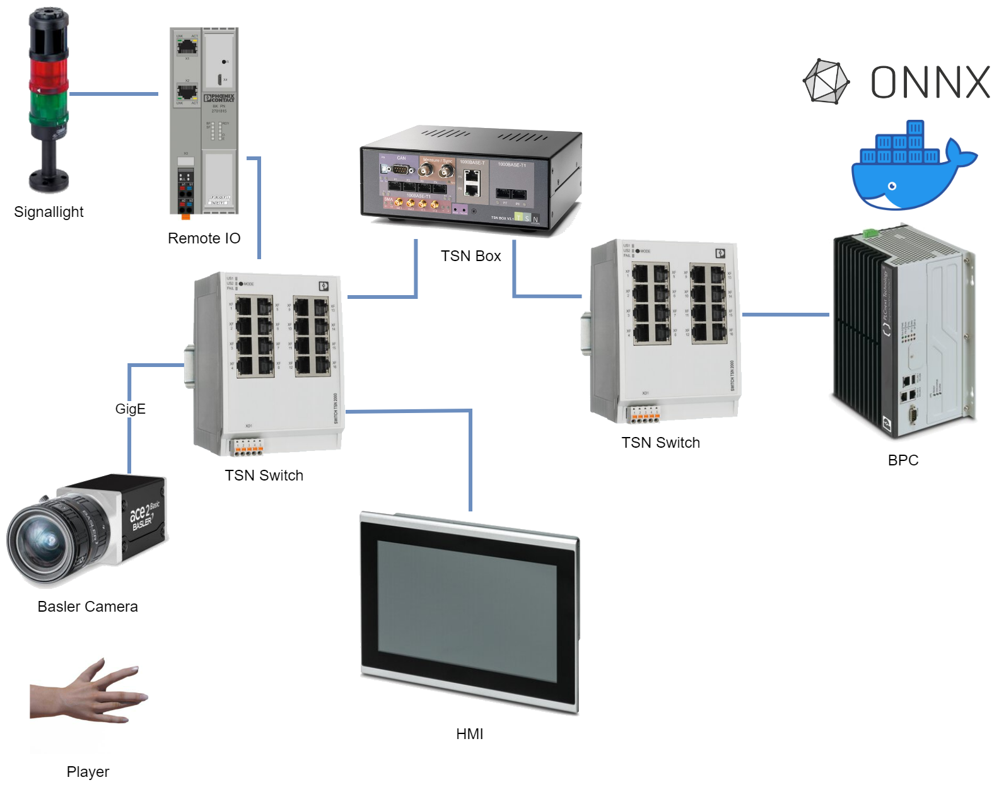

# PLCnext Engineer

This folder contains the plcnext engineer project.
This project is for a BPC 9102S with FW 2023.0 LTS and was created with engineer version 2023.9.

## Hardware

The hardware setup looks as follows.

The central component of the hardware setup are two [TSN switches](https://www.phoenixcontact.com/en-pc/2300-series-managed-tsn-switches).
There are 3 devices which are connected to the switches:

- a [Basler camera](https://docs.baslerweb.com/a2a1920-51gcbas) to record the player's hand (via GigE)
- a HMI to output the camera streams and results
- a [BPC9102S](https://www.phoenixcontact.com/en-pc/products/safety-controller-bpc-9102s-1246285) to run the application (SPS + Docker)

All traffic is passed through a [TSN Box](https://tsn.systems/en/test-measurement-solutions/) which is located in between the switches.
The TSN box monitores and visualizes the TSN packets.

